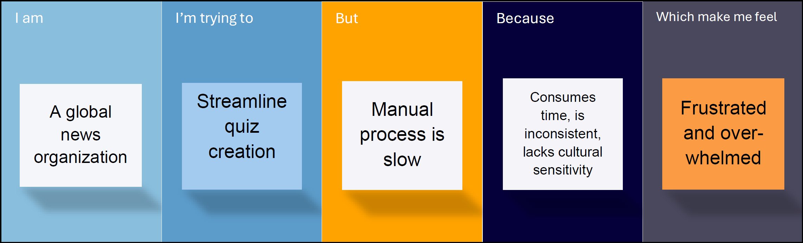
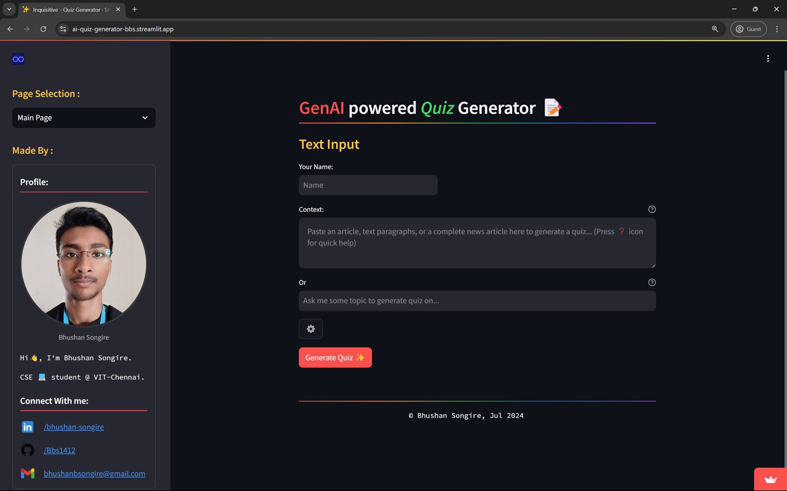
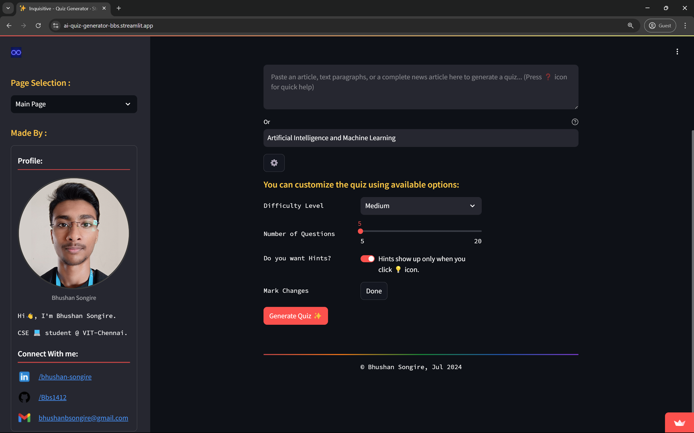
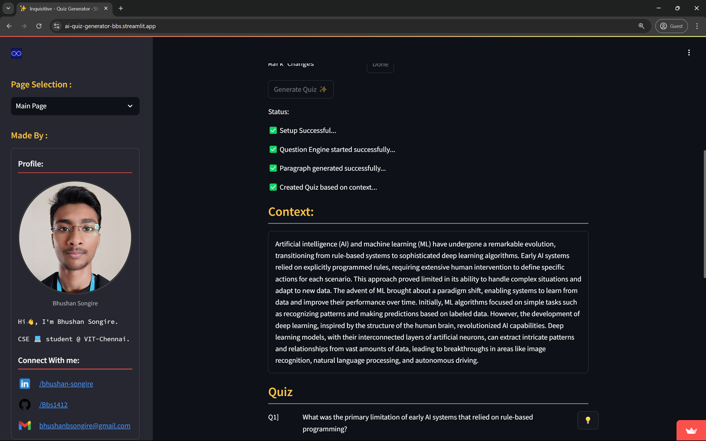
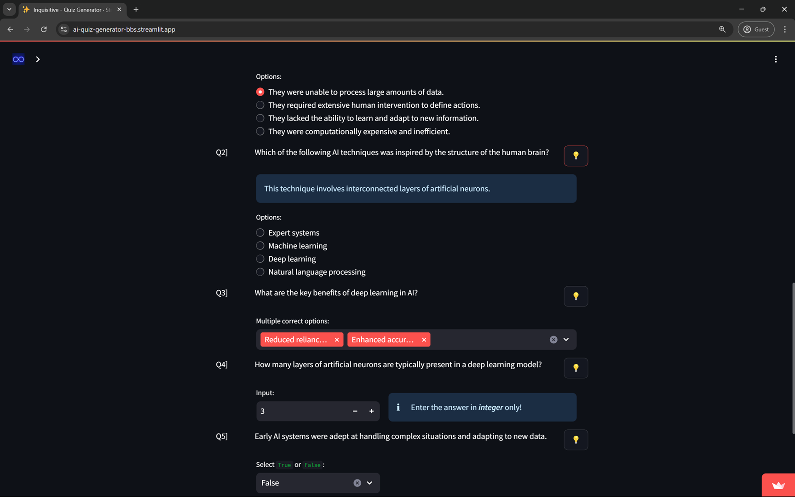
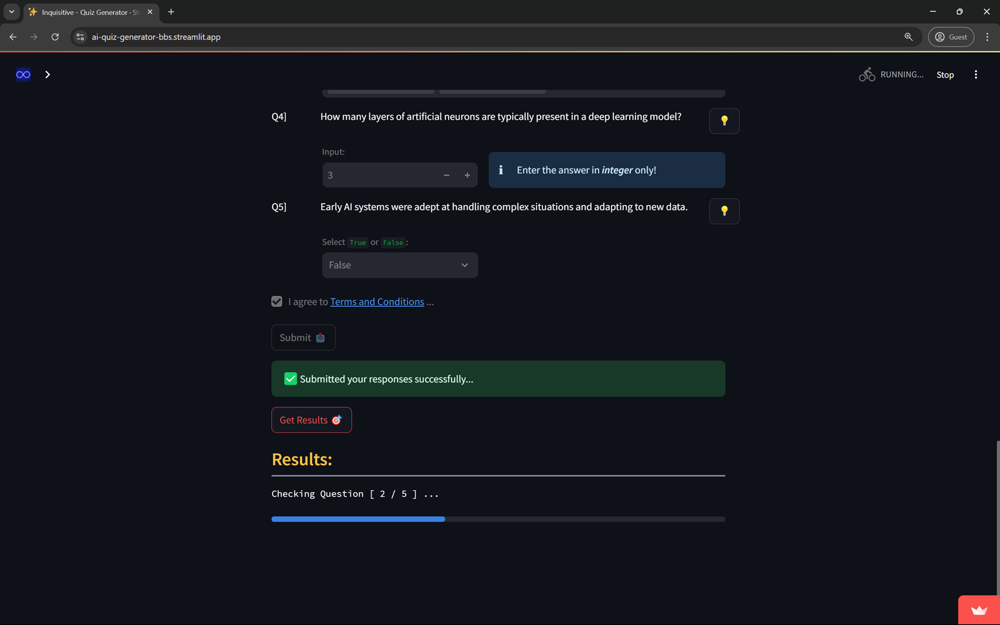
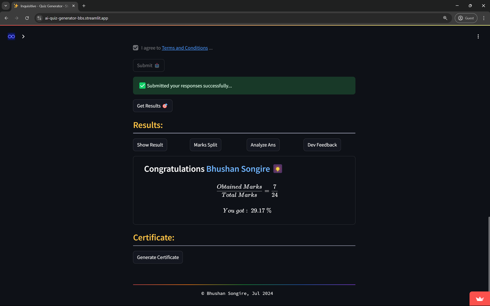
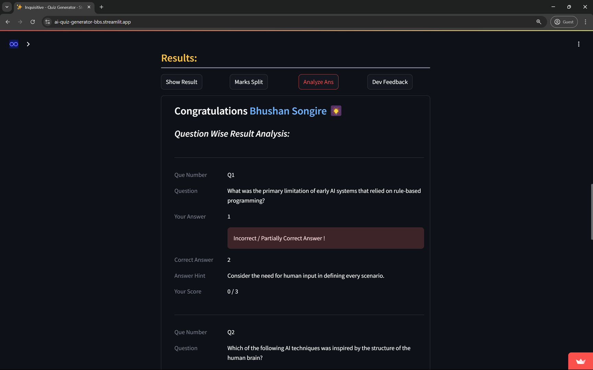
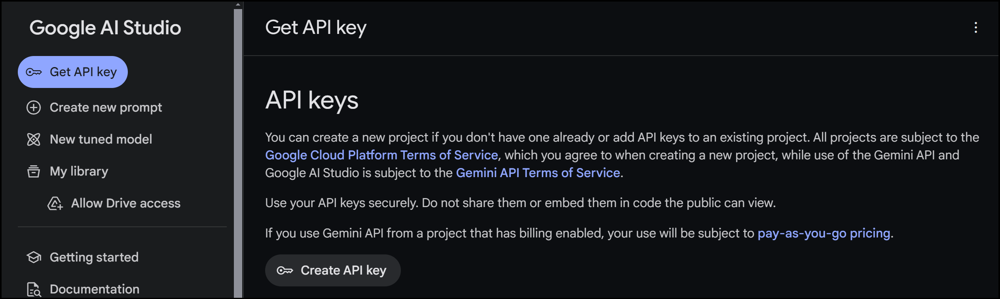

# `Inquisitive` Generative-AI Powered Multilingual Quiz Generator

<!-- <hr> -->

This repository contains the content of <u>Inquisitive:</u> generative artificial intelligence powered quiz generator.

## Table of Contents

- [`Inquisitive` Generative-AI Powered Multilingual Quiz Generator](#inquisitive-generative-ai-powered-multilingual-quiz-generator)
  - [Table of Contents](#table-of-contents)
  - [Problem Statement](#problem-statement)
  - [Approach](#approach)
  - [Project Overview](#project-overview)
  - [Tech-Stack 💻](#tech-stack-)
  - [Links](#links)
  - [Installation](#installation)
  - [Contributions](#contributions)
    - [Contact](#contact)


## Problem Statement
&nbsp; &nbsp; &nbsp;
Our client, NewsSphere, is a leading news organization dedicated to expanding its global reach and enhancing audience engagement. With a vast amount of content published daily in multiple languages, the organization faces the considerable challenge of manually creating quizzes and
assessments for each article. This process is not only time-consuming but also prone to inconsistencies across different languages and cultural contexts.




## Approach
* The project is AI-driven multilingual question generator which creates quizzes from any text/news articles in any language.  
* The project incorporates language detection, machine translation, and a large language model (LLM) for accurate and contextually relevant quiz generation.  
* It utilizes the Gemini-API to create quizzes based on the given text context. In cases where the user inputs a topic instead of a large text, a paragraph is first provided for user comprehension, and then the quiz is generated based on it.  
* Users' submissions are recorded, and results are generated. A detailed analysis section allows users to review their performance and submissions. The sleek and user-friendly interface, is made with Streamlit which ensures a smooth and engaging user-experience.


## Project Overview

1. **`User Input:`** User submits a topic or news article in any language.
     

2. **`Quiz Customizations:`** User can customize the quiz based on number of questions, difficulty level and requirement of hints.  
     

3. **`Paragraph Generation:`** In cases where the user inputs a topic instead of a large text, a paragraph is first provided for user comprehension.
     
   

4. **`Language Detection:`** The app utilizes the Translation API to detect the language of the submitted content.

5. **`Translation to English:`** If the content is not in English, the app translates it into English using the Translation API.

6. **`Question Generation:`** The app calls the Gemini API to generate diverse and contextually relevant questions based on the input.
     
  
7. **`Translation Back:`** The generated questions are translated back into the original language of the news article using the Translation API.

8. **`Output:`** The app presents the questions in the original language to the user in interactive format.

9.  **`Quiz:`** User can now answer the various types of the questions generated like MCQ, Multiple Correct, Numerical type and True / False.
      


10. **`Evaluation:`** Once quiz is submitted ✅, submissions are checked for correctness.
      

11. **`Result:`** Results are calculated and displayed on the page.
      

12. **`Analysis:`** All the questions and answers can be analyzed in provided result analysis section.
      


## Tech-Stack 💻
   - Python
   - Streamlit (Python)
   - Langdetect (python)
   - Gemini API
   

## Links

1. Visit the deployed project on Streamlit Community Cloud:  
    [Deployment Link](https://ai-quiz-generator-bbs.streamlit.app/)

## Installation

1. Clone the repository:
    ```bash
    git clone https://github.com/Bbs1412/Inquisitive_GenAI_quiz

    cd Inquisitive_GenAI_quiz
    ```

2. **Create and activate python environment:**  
    ```bash
    python -m venv env

    .\env\Scripts\activate
    ```

3. **Install the required libraries:**
    ```bash
    pip install -r requirements.txt
    ```

4. **Generate Gemini-API key:**  
    You need a Gemini API key to generate the content using Google's GenAI.  
   
   <!--    -->
     
  
5. **Create a file *'api.env'* in current directory and save the API-key in it:**
    ```python
    API="your_key"
    ```

6. Run the app:
   ```bash
   streamlit run app.py
   ```

<!-- 3. Video demonstration of project implementation:
   [Redirect to LinkedIn](https://--------) 
   future_work_here
   update the numbers as well
   -->

   
## Contributions  

   Any contributions to this repo or suggestions are welcome! 

## License
<!--
[](https://creativecommons.org/licenses/by-nc-nd/4.0/) 
[](https://creativecommons.org/licenses/by-nc-nd/4.0/)
-->
[](https://creativecommons.org/licenses/by-nc-nd/4.0/)


### Contact

   - **Email** - [bhushanbsongire@gmail.com](bhushanbsongire@gmail.com)
   <!-- - **Git** - [Bbs1412](https://github.com/Bbs1412/) -->


<!-- ## Acknowledgments -->
   <!-- - Thanks to .. for ... -->
